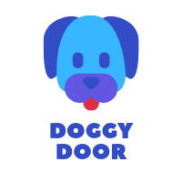
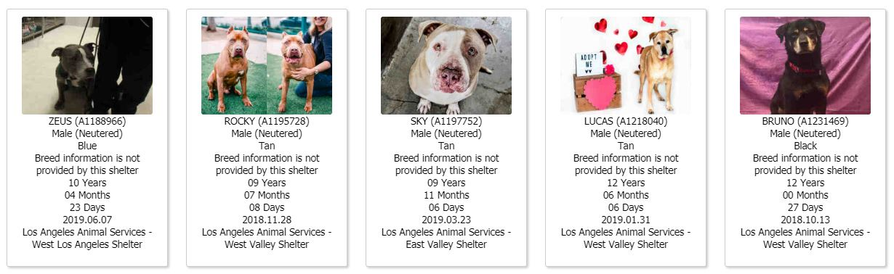
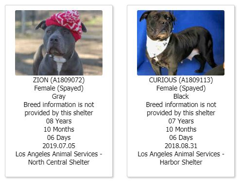
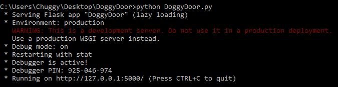
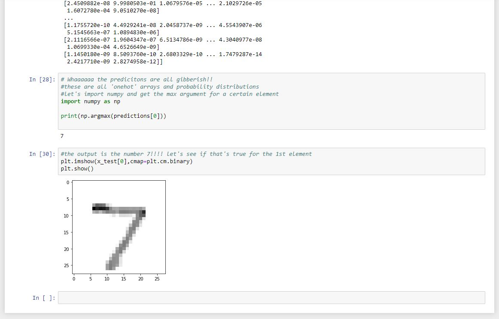
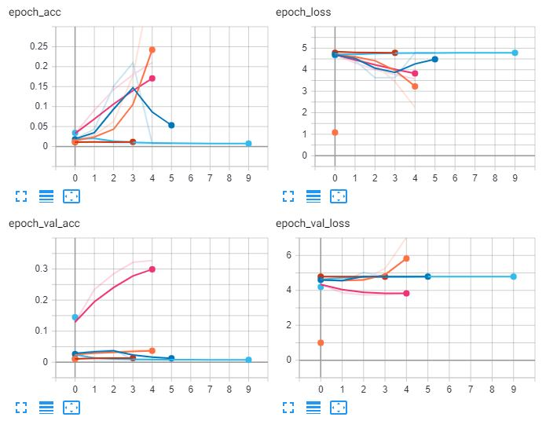
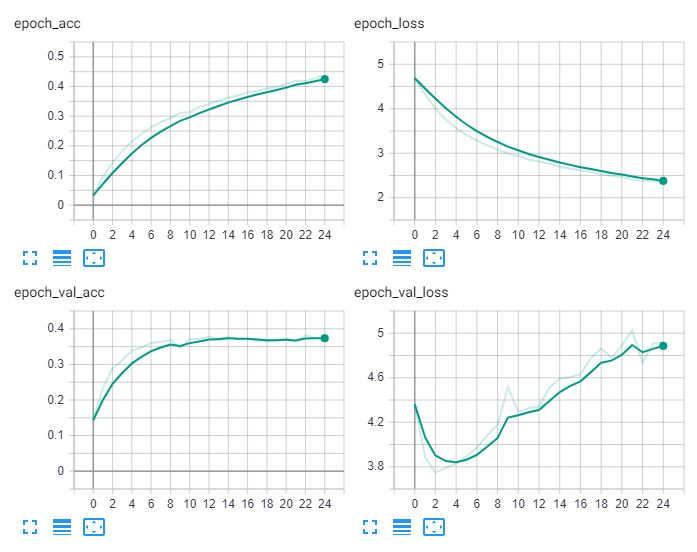
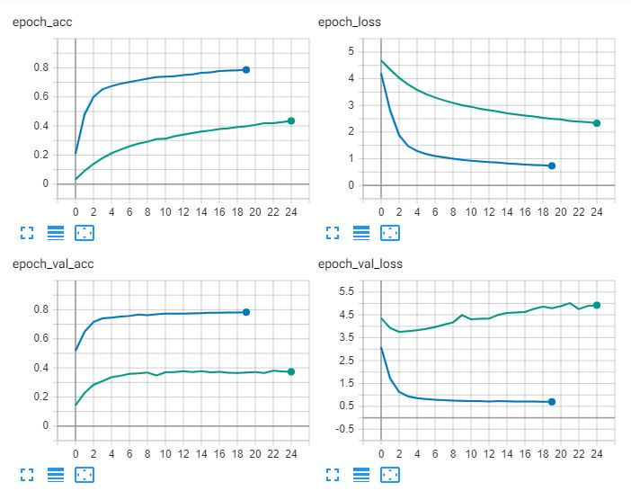

# DoggyDoor
A Python-Flask web application that attempts to eliminate some of the most common barriers to dog adoption.

<a href="https://www.python.org/">

</a>
<a href="http://flask.pocoo.org/">

</a>
<a href="https://pytorch.org/">

</a>
<a href="https://www.gnu.org/licenses/gpl-3.0.en.html">

</a>

## General info
This project uses a machine learning algorithm, and an interactive web interface to provide potential "dog-parents" more information about their adoption candidate, and hopefully increase the likelihood of adoption.

## 🚩 Table of contents
* [General info](#general-info)
* [Problem](#problem)
* [Solution](#solution)
* [How to Use](#how-to-use)
  * [Clone Repository](#clone-repository)
  * [Install Dependencies](#install-dependencies)
  * [Run DoggyDoor.py](#run-doggydoor.py)
  * [Navigate to Localhost](#navigate-to-localhost)
* [Uses](#uses)
  * [Standalone Website](#standalone-website)
  * [Existing Website Integration](#existing-website-integration)
* [How it was Built](#how-it-was-built)
  * [1. Learning About Keras](#1.-learning-about-keras)
  * [Convolutional Neural Networks](#2.-convolutional-neural-networks)
  * [Initial CNN Architectures](#3.-initial-cnn-architectures)
  * [Transfer Learning](#4.-transfer-learning)
  * [Pretrained Models](#5.-pretrained-models)
  * [Putting it All Together](#6.-putting-it-all-together)
* [Future Improvements](#future-improvements)
* [Acknowledgments](#acknowledgments)
* [License](#-license)

## Problem
One of the most common problems that shelters face when posting profiles of dogs for adoption is a lack of information. The dog's breed, age, mix, and medical history are often hard to ascertain and because of this, profiles can sometimes be posted with vital information missing.



Furthermore, the conditions in dense, urban shelters are not conducive to a healthy environment for most dogs. This problem is only exacerbated as shelters attempt to keep hundreds of dogs physically and mentally happy in preparation for their adoption.

While the shelters do their best to attract quality adopters with lighthearted props and toys, most profiles, in stark contrast, can seem depressing, making it hard to potential adopters to see an animal's true potential.



## Solution
DoggyDoor is an interactive web application that attempts to give shelter managers or potential adopting families more information and insight into the dog they are interested in.

By simply uploading an image of a dog, DoggyDoor will use a machine learning algorithm trained on thousands of images to guess the breed/breeds of dog in the image and pull information from "The American Kennel Club" to give users vital information on the dog.


## How to Use

DoggyDoor was made to be run on your local machine with only a few simple commands. The following setup steps will walk you through the installation and operation of DoggyDoor.

  * #### Clone Repository
   Either download from a GUI or run the 'git clone' command on this url...
   ```
   https://github.com/OliverMathias/DoggyDoor
   ```

  * #### Install Dependencies
   cd into the DoggyDoor folder and run this command to install all dependencies at once...
  ```
  $ pip install -r dependencies.txt
  ```

  * #### Run DoggyDoor.py
   Finally, cd into the folder and run DoggyDoor.py

  ```
  $ python DoggyDoor.py
  ```

  * #### Navigate to Localhost
  By running the DoggyDoor.py file above you have started a localhost process that holds the DoggyDoor application. You should see some output in your terminal that looks like this.

  

  In the output above, Flask provides you with the localhost port that DoggyDoor is out of. It's usually "localhost:5000" however, it could vary and the best practice is to simply look at the terminal/cmd output.

  Navigate to that port and starting unlocking more information about your furry friend!

  

## Uses

Obviously this is a very simple implementation of a dog breed classification algorithm. In it's current state it's perfect for use by shelter employees who want to provide more information about their dogs. However, with a few modifications it could be deployed elsewhere for greater impact.

* #### Standalone Website

  DoggyDoor was created to be easily converted into a Standalone website, the only modification necessary is pretty much just moving it to a dedicated server. By moving it to it's own public server and making sure that all dependencies are working you can set up your own dog breed information website!

* #### Existing Website Integration

  Following the same logic, an established website could also easily integrate DoggyDoor with their own website. This would provide their customers with more information about their dogs, and would also cut down on the time humans would need to perform mundane data entry tasks.

## How it was Built

This section is for someone who wants to build a similar project as DoggyDoor and wants some help finding resources and common mistakes.

* #### 1. Learning About Keras
  Before starting this project I had no idea what Keras was. Most of my machine learning knowledge and practice has come from [Andrew Ng's free Machine Learning course]("https://www.coursera.org/learn/machine-learning"), which is almost 10 years old and based mostly in MatLab. In order to get acquainted with modern machine learning practices in Python I followed a short [tutorial]("https://www.youtube.com/watch?v=wQ8BIBpya2k") on Keras in the similar arena of Digit Classification.

  

  This is really a great [tutorial]("https://www.youtube.com/watch?v=wQ8BIBpya2k") for beginners and I would highly recommend [Sentdex]("https://www.youtube.com/channel/UCfzlCWGWYyIQ0aLC5w48gBQ") (the author) as a learning resource for AI overall.

* #### 2. Convolutional Neural Networks
  The next step after getting some practice with Keras was to build a simple Convolutional Neural Network, or CNN. This network architecture is the backbone for image classification and If I was to build a classifier for anything more complex than digits I would need more practice. Amazingly, [Sentdex]("https://www.youtube.com/channel/UCfzlCWGWYyIQ0aLC5w48gBQ") had an entire [tutorial series]("https://www.youtube.com/watch?v=gT4F3HGYXf4") on building CNN's in Keras to classify Dogs and Cats!

  I followed along with his tutorial, making a few adjustments as I went to prepare the first model to classify 120 dog breeds instead of a binary classification between dogs and cats.

  

  **Note**, The dataset for this project can be found [here]("http://vision.stanford.edu/aditya86/ImageNetDogs/"), or below in the [Acknowledgments](#acknowledgments).

  Again, I cannot recommend his [video series]("https://www.youtube.com/watch?v=gT4F3HGYXf4") highly enough!

* #### 3. Initial CNN Architectures
  Now, armed with my new knowledge on CNN's and image classification, I set off to train a basic network to classify 120 different dog breeds. How hard could it be? I watched a tutorial after all.

  Turns out, this is an extremely different problem to the one of binary classification that Sentdex had showcased in his tutorial. The same network from the tutorial achieved a measly **4% validation accuracy**.

  The next few models weren't much better, none of them reaching a validation accuracy of more than **~5%**.

  However, in the next step I discovered that by adding layers, the validation accuracy increased by about **600%**. It still wasn't much, only around **30%**, however we were heading in the right direction.

  

  After adding a few more layers, discovering dropout values, and borrowing from other networks on the internet, I managed to get the validation accuracy of the model up to **~40%**.

  

* #### 4. Transfer Learning
 At this point I had reached near the limits of the architecture of CNN I was using and after further research, discovered that by implementing a top layer trained on other images, and retraining it, I could pass on new and more features that my CNN could then interpret.  

 This strategy is called '[Transfer Learning]("https://machinelearningmastery.com/transfer-learning-for-deep-learning/")' and has been found to greatly increase the accuracy of image classification networks. It also cuts down on the training time needed to achieve that increased accuracy.

 More concretely,
 >"Transfer learning and domain adaptation refer to the situation where what has been learned in one setting … is exploited to improve generalization in another setting"
 — Page 526, Deep Learning, 2016.

 By implementing a popular image classification network call [InceptionV3]("https://medium.com/@sh.tsang/review-inception-v3-1st-runner-up-image-classification-in-ilsvrc-2015-17915421f77c") trained on the [ImageNet]("http://www.image-net.org/") dataset of over 14M images, the network was able to achieve **~80%** validation accuracy.



* #### 5. Pretrained Models
  During my research of CNN's I discovered that Kaggle had put on a challenge to see who could train the best dog breed classification network on their own dataset of 133 breeds.

  [srikantrao]("https://github.com/srikantrao") on GitHub had an especially thorough and verbose Jupyter Notebook on his [implementation]("https://github.com/srikantrao/Dog-Breed-Classifier/blob/master/README.md") of a InceptionV3 and Keras to classify dog breeds.

  After copying his code, and the InceptionV3 model, and training those on my own dataset the model was able to achieve **88%** accuracy! An 8% increase from the last iteration.

* #### 6. Putting it All Together
 The final steps were to clean up the code, make sure the DoggyDoor.py file contained methods that could interact with flask, and to create a sleek interface that users would find intuitive and informative.


I'd like to acknowledge all the sources below that made this project possible, and especially thank [srikantrao]("https://github.com/srikantrao") and his hard work on the model that allowed DoggyDoor to reach that extra 8% accuracy!

## Future Improvements
As this is my first ML project I wasn't able to build it out to the extent that I would have liked to. In the future I would like to be able to get my own models up to the validation accuracy that I find acceptable.

While I was only able to train my own model to 80% accuracy this time, I'm always looking to improve and will most likely implement a redesigned model in the future to reach an accuracy I can be proud of.


## Acknowledgments
* [srikantrao]("https://github.com/srikantrao")
* [Sentdex]("https://www.youtube.com/channel/UCfzlCWGWYyIQ0aLC5w48gBQ")
* [Dog Dataset]("http://vision.stanford.edu/aditya86/ImageNetDogs/")

## 📜 License
This project is licensed under the GNU License - see the [LICENSE.md](LICENSE.md) file for details
